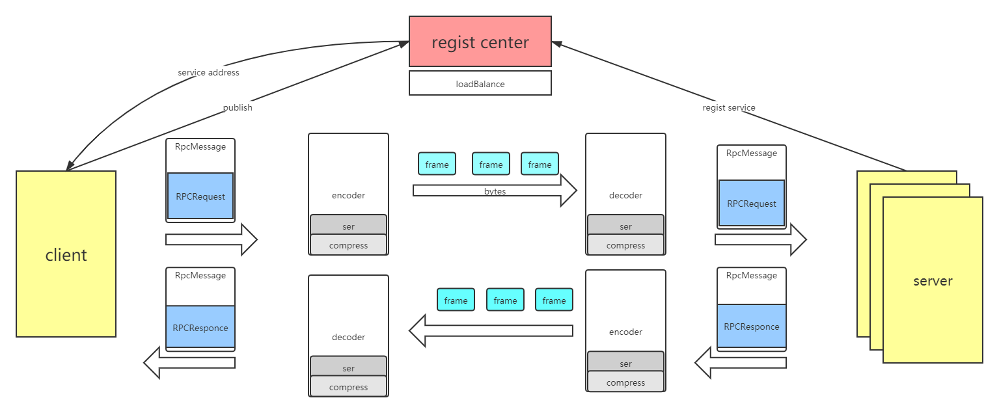

# LeezyRPC-framework
### 介绍

手动造了个Netty+Zookeeper+Kyro实现的RPC轮子。作为第一次完整的项目设计，主要参考了guide哥的[guide-rpc-framework](https://github.com/Snailclimb/guide-rpc-framework) 框架的实现方案。实现这个RPC框架的目的是加深自己对Netty、Zookeeper等框架的使用，丰富自己的项目设计经验以及锻炼自己的代码能力。整个项目的架构图：

